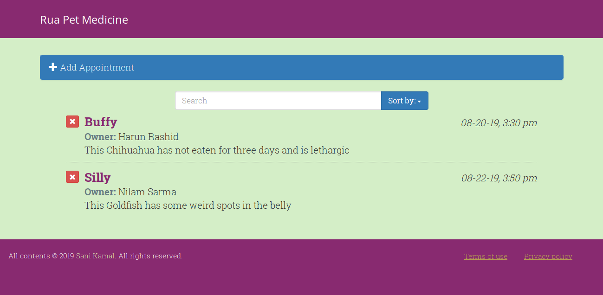
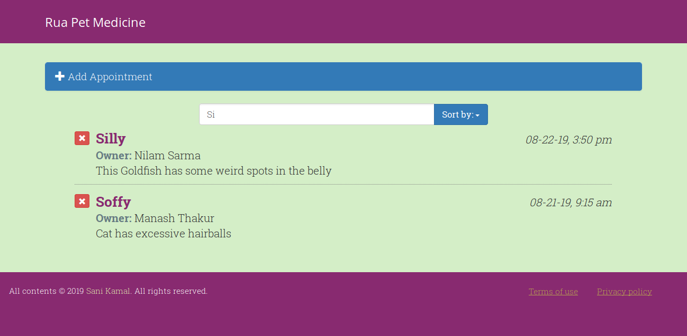
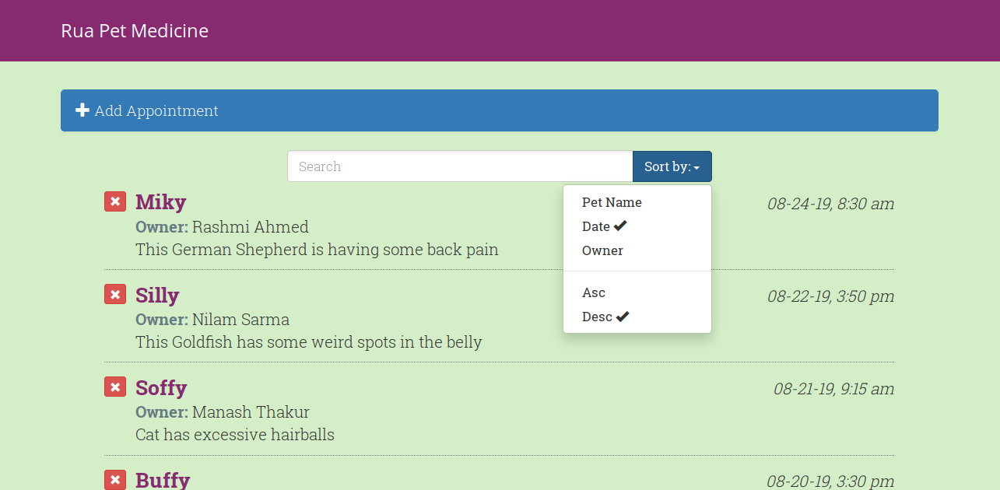
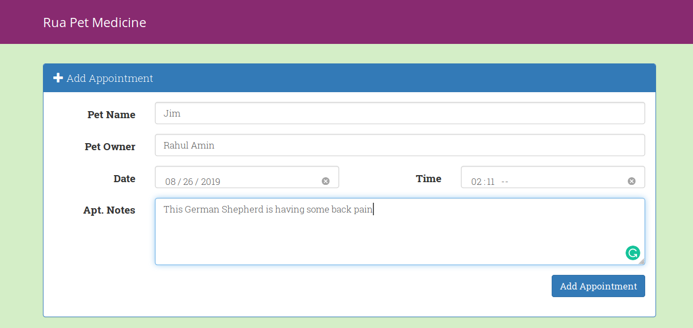

# Rua Pet Medicine (Vue.js: Building an Interface)

## Contents
- Creating basic apps
- Using lifecycle hooks
- Adding nested subcomponents
- Modifying data with methods and events
- Working with layouts
- Searching, sorting, and ordering

## Installing
1. Make sure you have these installed
	- [node.js](http://nodejs.org/)
	- [git](http://git-scm.com/)
2. Clone this repository into your local machine using the terminal (mac/linux) or Gitbash (PC) `> git clone CLONEURL`
3. CD to the folder `cd FOLDERNAME`
4. Run `> npm install` to install the project dependencies
5. Run `>npm run dev` to start live preview server
